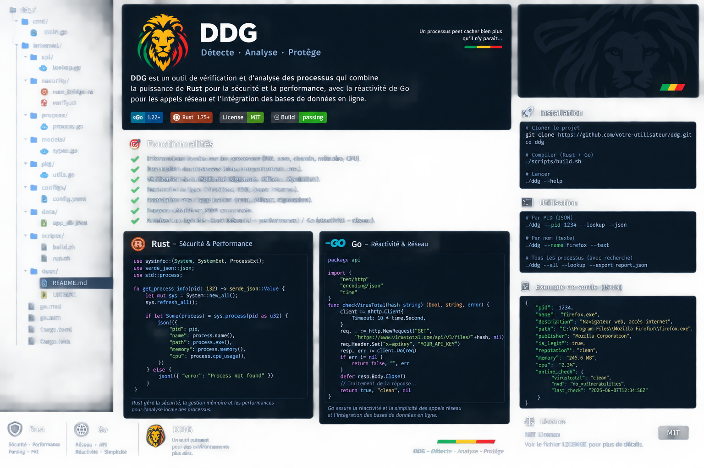

<p align="center">
  
</p>
<h1 align="center">DDG — Detect · Analyze · Protect</h1>
<p align="center"><b>Rust pour la collecte locale et la sécurité · Go pour l'orchestration, la réactivité et le réseau</b></p>

<p align="center">
  
</p>

[Français](README.fr.md) · [Architecture](docs/README.md)

## What DDG does

DDG inspects a process by PID, name or globally. The MVP returns the process name, what it appears to do, executable path, CPU, memory, parent PID, user, SHA-256, local application association and a deliberately conservative legitimacy assessment.

With `--lookup`, Go launches concurrent online reputation checks. The first integration is VirusTotal's file-report API, queried by the binary hash. DDG does not upload the file in this MVP: only its hash is sent to the provider.

## Architecture

```text
                +-----------------------+
                |       ddg (Go)        |
                | CLI + rendering + API |
                +-----------+-----------+
                            |
                     JSON-lines IPC
                            |
                +-----------v-----------+
                |   ddg-agent (Rust)    |
                | process + hash + trust |
                +-----------+-----------+
                            |
                    local OS process
                            |
                +-----------v-----------+
                |  Online reputation    |
                | VirusTotal (optional) |
                +-----------------------+
```

Rust is deliberately responsible for the low-level boundary: process inspection, path handling and streaming SHA-256. Go owns the user-facing flow, concurrent lookups and report formatting.

## Quick start

Requirements: Go 1.23+, Rust stable, Cargo.

```bash
cp .env.example .env
# export DDG_VT_API_KEY="..."   # optional for online lookups
./scripts/build.sh

./dist/ddg --pid 1234 --text
./dist/ddg --pid 1234 --lookup --json
./dist/ddg --name firefox --text
./dist/ddg --all --lookup --export report.json
```

On Windows, use `scripts/build.ps1`.

## Example JSON

```json
{
  "pid": 1234,
  "name": "firefox.exe",
  "description": "Navigateur web Firefox : accès aux sites et applications internet.",
  "executable": "C:\\Program Files\\Mozilla Firefox\\firefox.exe",
  "memory_bytes": 257638400,
  "cpu_percent": 2.31,
  "sha256": "...",
  "application": {
    "name": "Mozilla Firefox",
    "publisher": "Mozilla",
    "category": "browser"
  },
  "legitimacy": {
    "status": "likely_legitimate",
    "confidence": "medium",
    "signature_status": "not_checked"
  },
  "online_checks": [
    {
      "provider": "virustotal",
      "status": "found",
      "detection_count": 0
    }
  ]
}
```

## Important security behavior

`likely_legitimate` is a heuristic, not a cryptographic guarantee. Unknown processes remain `unknown`. The MVP also reports `signature_status=not_checked`; native Windows/macOS/Linux signature verification belongs to the next security phase.

Do not put API keys in source code or reports. Prefer environment variables or a platform secret store.

## Roadmap

Phase 1: local process details + SHA-256.

Phase 2: online reputation providers and cached background enrichment.

Phase 3: native signature/PKI verification, CSV/SIEM output, policy engine.

Phase 4: richer application database, YARA/IOC integrations, long-running daemon mode, signed releases.

## License

MIT. See [LICENSE](LICENSE).
